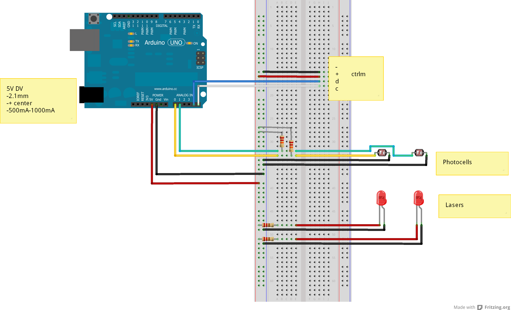

## Instructions for creating BlinkM Sequence
1. Download and install the [ThingM Multitrack sequencer](http://thingm.com/products/blinkm.html). 
2. Plug BlinkM > LinkM
3. Connect LinkM > usb port
4. Open Multitrack sequencer program on computer
5. Program sequence using the UI
6. Click "Upload to BlinkMs"
7. Re-attach BlinkM > FreeM
8. Now, when the directional trip wire is triggered, the BlinkM will flash with the pattern that you created in the sequencer.